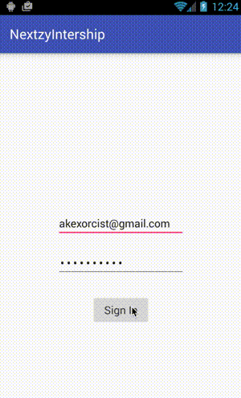

# Simple Internship Quiz
แบบทดสอบง่ายๆสำหรับน้องๆนักศึกษาฝึกงาน

## เกริ่นเรื่องราว

พี่ๆที่ Nextzy ได้สร้างแอพขึ้นมาตัวหนึ่งเพื่อทำการลงทะเบียนผู้ใช้เข้าไปในระบบของเซิฟเวอร์ที่ทำไว้แล้ว โดยมีหลักการง่ายๆคือ 
  * ล็อกอินด้วยอีเมลล์และรหัสผ่าน (หน้าที่ 1)
  * เมื่อล็อกอินเสร็จจะขึ้นข้อความว่า **"You're signed in"** แล้วก็จะเข้าสู่หน้าลงทะเบียน (หน้าที่ 2)
  * กดปุ่ม Add New User เพื่อทำการลงทะเบียน
  * รอจนกว่าจะส่งข้อมูลไปที่เซิฟเวอร์จนเสร็จ
  * ถ้าลงทะเบียนสำเร็จจะขึ้นข้อความบอกว่า **"Congratulation! You're finished this internship test."** แต่ถ้าไม่สำเร็จก็จะแจ้งเป็นข้อความอื่นๆ

การทำงานของแอพจะเป็นประมาณนี้



ซึ่งแอพตัวนี้เป็นแอพของลูกค้ารายใหญ่เจ้าหนึ่งที่ต้องการใช้งานในวันพรุ่งนี้ตอนเย็นๆ และแอพตัวนี้ก็เขียนเสร็จแล้วและพร้อมที่จะนำไปใช้งานจริงแล้ว


## แต่!!! ปัญหาบังเกิดขึ้นในค่ำคืนนั้น
ไอ้ต้นเทพแอนดรอยด์ที่ชอบกินเหล้าเป็นชีวิตจิตใจ เมื่อคืนก่อนมันได้กินเหล้าไปหนักมากกกกกก ไม่รู้อะไรดลใจมัน ทำให้มันเปิดเครื่องคอมคู่ใจของมันขึ้นมา แล้วมาแก้ไขโค้ดที่เคยเขียนเสร็จแล้ว โดยมันบอกกับทุกๆคนว่า "เฮ้ย ไม่ต้องห่วง กูแค่ปรับโค้ดให้มันสวยงามมากขึ้น" แล้วมันก็นั่งพิมพ์คีย์บอร์ดอย่างเมามันต่อไปท่ามกลางความมึนเมา

เช้ารุ่งขึ้นเมื่อทุกคนตื่นขึ้นจากปาร์ตี้ในค่ำคืนที่ผ่านมา ก็ได้ตรวจเช็คการทำงานของแอพว่าถูกต้องและเรียบร้อยหรือไม่ เพื่อให้มั่นใจว่าตอนที่ส่งงานให้ลูกค้าจะไม่เกิดอะไรผิดพลาด

และนั่นก็คือช่วงเวลาแห่งความชิบหายจากฝีมือไอ้ต้น...

**แอพไม่ทำงาน เพราะมัน ไอ้ต้นเมิง!!**

แอพเกิดปัญหาต่างๆนานา ไม่ว่าจะแอพเด้งจนปิดตัวเองไป หรือกดแล้วไม่ทำงานตามที่ควรจะเป็น ซึ่งไอ้ต้นที่เป็นตัวต้นเหตุก็ยังคงหลับอยู่เพราะกินเหล้าไปเยอะกว่าชาวบ้าน

## ถึงเวลาของน้องๆแล้ว

ภารกิจของน้องคือ **ทำให้แอพตัวนี้กลับมาทำงานได้เหมือนเดิม** โดยใช้เบาะแสจากโค้ดที่ยังหลงเหลืออยู่ในโปรเจค และทำให้มันทำงานได้ถูกต้องก่อนที่จะถึงเดดไลน์ที่ต้องเอางานไปส่งลูกค้า
 
อนาคตของ Nextzy ขึ้นอยู่กับน้องๆแล้ว เพราะถ้างานตัวนี้พลาดไปล่ะก็ ความชิบหายจะเกิดขึ้นกับบริษัทแน่นอน เพราะลูกค้าคนนี้สำคัญมากกกกกกกกกก (สวยและน่ารักด้วย)
  
## ต้องทำอะไรบ้าง?
ดาวน์โหลดโปรเจคจาก Repository ใน GitHub อันนี้ไป แล้วทำให้มันถูกต้องซะ โดยพวกพี่ๆจะตรวจสอบจากฝั่งเซิฟเวอร์ด้วยว่าข้อมูลถูกลงทะเบียนมาที่เซิฟเวอร์จริงๆหรือไม่ โดยใครที่ทำได้สำเร็จก่อน พวกพี่ๆก็จะเห็นชื่อของน้องๆคนนั้นขึ้นก่อนเป็นคนแรกนั่นเอง

สู้ๆล่ะเหล่านักศึกษาทั้งหลาย

## เพิ่มเติม
น้องๆสามารถกำหนดอีเมลล์และรหัสผ่านได้ที่ไฟล์ AuthConfig.java ที่อยู่ในโปรเจคได้เลย จะได้ไม่ต้องพิมพ์รหัสผ่านเองใหม่ทุกครั้ง

```java
public class AuthConfig {
    public static final String USERNAME = "YOUR_USERNAME";
    public static final String PASSWORD = "YOUR_PASSWORD";
}
```


